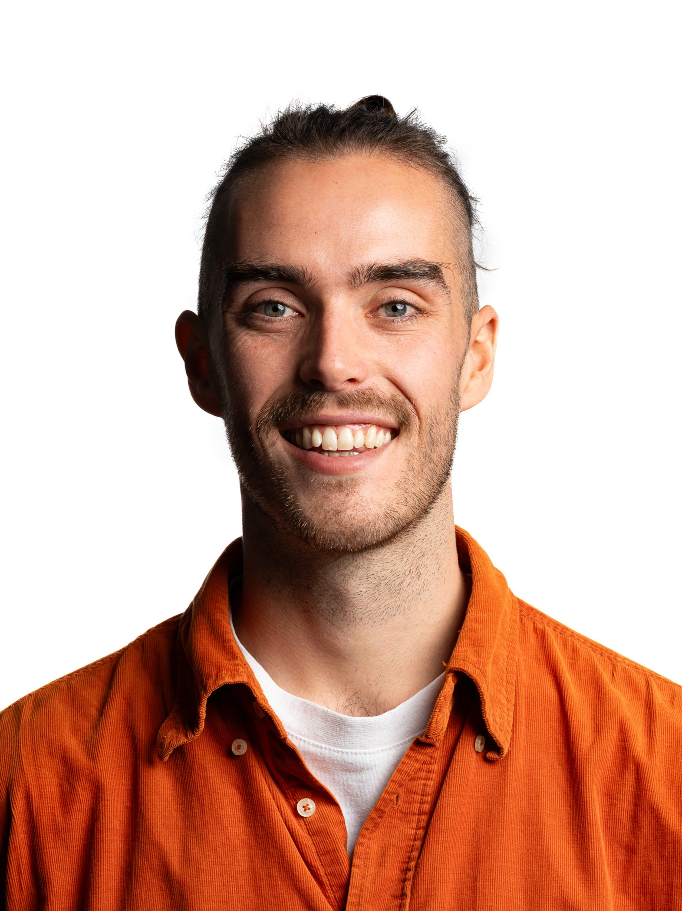

  <!-- Left section with the photo -->
  

    
  

  <!-- Right section with custom text -->
  

    I'm a PhD candidate at the University of Amsterdam with <a href="https://sites.google.com/view/irisgroen" target="_blank">Iris I. A. Groen</a> and H. Steven Scholte.

    In my research, I leverage methods from Machine Learning, specifically Computer Vision, in combination with state-of-the-art neuroimaging techniques to study the underlying principles of human visual processing. I work in close collaboration with the Cognitive AI and Vision Amsterdam (CAVA) lab at the <a href="https://psyres.uva.nl/content/research-groups/programme-group-brain-and-cognition/programme-group-brain-and-cognition.html">Brain and Cognition Group Psychology Department</a>, <a href="https://ivi.fnwi.uva.nl/vislab/">the Video and Image Sense Lab (VISlab)</a> at the Informatics Institute, both at the University of Amsterdam. My project is embedded in and funded by the <a href="https://dsc.uva.nl/content/news/2021/10/seven-new-interdisciplinary-data-science-phd-positions.html">Interdisciplinary PhD Program of the UvA Data Science Center</a>.

    
Feel free to explore my <a href="./assets/files/Scientific_CV_NiklasMueller-EN.pdf" target="_blank">CV</a> or browse my <a href="link-to-research">research highlights</a>.

  

<!-- 

I'm a PhD candidate at the University of Amsterdam with [Iris I. A. Groen](https://sites.google.com/view/irisgroen) and H. Steven Scholte.

In my research, I leverage methods from Machine Learning, specifically Computer Vision, in combination with state-of-the-art neuroimaging techniques to study the underlying principles of human visual processing. I work in close collaboration with the Cognitive AI and Vision Amsterdam (CAVA) lab at the [Brain and Cognition Group](https://psyres.uva.nl/content/research-groups/programme-group-brain-and-cognition/programme-group-brain-and-cognition.html) (Psychology Department), the [Video and Image Sense Lab (VISlab)](https://ivi.fnwi.uva.nl/vislab/) at the Informatics Institute, both at the University of Amsterdam. My project is embedded in and funded by the [Interdisciplinary PhD Program](https://dsc.uva.nl/content/news/2021/10/seven-new-interdisciplinary-data-science-phd-positions.html) of the UvA Data Science Center. -->
